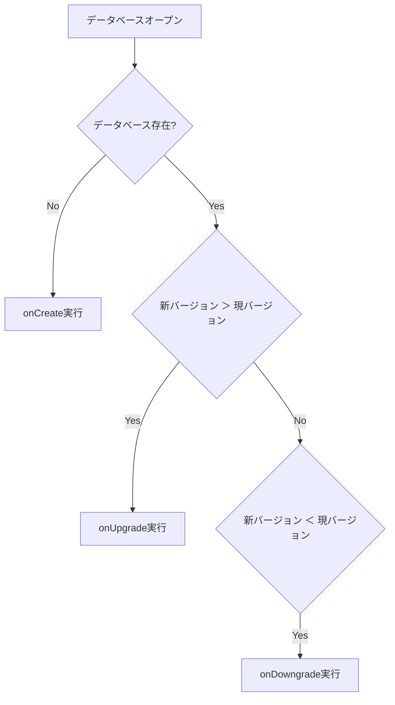

# SQLite データベースとは

SQLite は軽量で高性能なデータベースで、モバイルアプリケーションでローカル DB として使用されます。アプリ内のデータを効率的に保存・管理するために、適切な使い方を学びます。

## データベースの基本設定

データベースを使用するためには、まずアプリ内でデータベースファイルを作成し、適切な場所に保存する必要があります。Android と iOS では保存場所が異なりますが、`getDatabasesPath()`を使用することで、プラットフォームに適した場所を自動的に取得できます。

### データベースの場所を設定する

データベースファイルを作成する前に、保存先のディレクトリが存在することを確認しましょう。存在しない場合は作成します。

```dart
// データベースの保存場所を取得
var databasesPath = await getDatabasesPath();
var path = join(databasesPath, 'myapp.db');

// ディレクトリが存在することを確認
try {
  await Directory(databasesPath).create(recursive: true);
} catch (_) {}
```

### データベースを開く

データベースを開く方法は複数あります。最も基本的な方法は`openDatabase`を使用することですが、外部キー制約など、特別な設定が必要な場合は`onConfigure`コールバックを使用します。

```dart
// 基本的な開き方
var db = await openDatabase('myapp.db');

// 外部キー制約を有効にする場合
Future<void> _onConfigure(Database db) async {
  await db.execute("PRAGMA foreign_keys = ON");
}

var db = await openDatabase(
  path,
  onConfigure: _onConfigure
);
```

## データベースの初期設定とデータ投入

新しくデータベースを作成する際は、テーブルの作成と初期データの投入が必要です。これらの処理は`onCreate`コールバックで行います。

### テーブル作成と初期データ

以下の例では、ユーザー情報を保存するためのテーブルを作成し、テスト用の初期データを投入しています。

```dart
// データベース作成時の処理
Future<void> _onCreate(Database db, int version) async {
  // ユーザーテーブルを作成
  await db.execute('''
    CREATE TABLE Users (
      id INTEGER PRIMARY KEY,
      name TEXT,
      email TEXT
    )
  ''');

  // 初期データを追加
  await db.insert('Users', {
    'name': 'テストユーザー',
    'email': 'test@example.com'
  });
}

var db = await openDatabase(
  path,
  version: 1,
  onCreate: _onCreate
);
```

## バージョン管理とマイグレーション

アプリケーションの進化に伴い、データベースの構造を変更する必要が出てきます。このような変更を安全に行うために、バージョン管理とマイグレーションの仕組みが用意されています。

### バージョン管理の仕組み



### バージョンアップ時の処理

データベースの構造を変更する際は、必ずバージョン番号を上げ、`onUpgrade`コールバックで変更内容を実装します。

```dart
Future<void> _onUpgrade(Database db, int oldVersion, int newVersion) async {
  if (oldVersion < 2) {
    // バージョン2でテーブルに新しい列を追加
    await db.execute('ALTER TABLE Users ADD age INTEGER');
  }
}

var db = await openDatabase(
  path,
  version: 2,
  onCreate: _onCreate,
  onUpgrade: _onUpgrade
);
```

## 安全なデータベースアクセス

データベースの操作は、アプリケーションのパフォーマンスとデータの整合性に大きく影響します。そのため、適切な実装パターンを採用することが重要です。

### シングルトンパターンの実装

データベースへの同時アクセスを防ぎ、効率的な管理を行うために、シングルトンパターンを使用します。

```dart
class DatabaseHelper {
  static final DatabaseHelper instance = DatabaseHelper._();
  static Database _database;

  DatabaseHelper._();

  Future<Database> get database async {
    _database ??= await _initDatabase();
    return _database;
  }

  Future<Database> _initDatabase() async {
    var path = await getDatabasesPath();
    return await openDatabase(
      join(path, 'myapp.db'),
      version: 1,
      onCreate: _onCreate
    );
  }
}
```

## トラブルシューティング

データベース操作では様々なエラーが発生する可能性があります。主なエラーケースとその対策を説明します。

### エラー対策コード例

```dart
Future<Database> safeOpenDatabase(String path) async {
  try {
    // ディレクトリ存在確認
    var dir = Directory(dirname(path));
    if (!await dir.exists()) {
      await dir.create(recursive: true);
    }

    return await openDatabase(
      path,
      version: 1,
      onCreate: _onCreate,
      onOpen: (db) async {
        print('データベースバージョン: ${await db.getVersion()}');
      }
    );
  } catch (e) {
    print('データベースオープンエラー: $e');
    rethrow;
  }
}
```

### 重要な注意点

1. データベースは一度だけ開く
2. バージョン管理は常に増加する方向で行う
3. エラーハンドリングを適切に実装する
4. テーブル構造の変更は慎重に行う

## 参照

https://github.com/tekartik/sqflite/blob/master/sqflite/doc/opening_db.md
