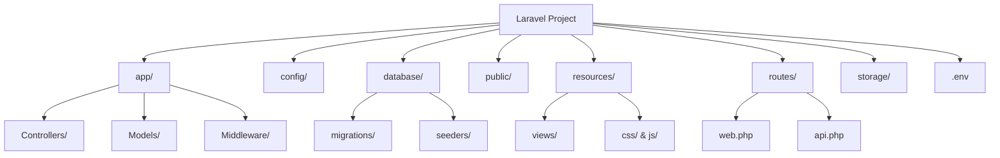

# Laravel プロジェクトの構造を理解しよう

## はじめに

Laravel は、多くのディレクトリやファイルで構成されています。これらの役割を理解することで、効率的な開発が可能になります。この記事では、初学者の方にもわかりやすく、Laravel プロジェクトの構造について説明します。

## プロジェクト構造の全体像

Laravel プロジェクトを作成すると、多くのフォルダとファイルが生成されます。この構造は、MVC アーキテクチャ（Model-View-Controller）に基づいており、コードを整理しやすくなっています。

```
laravel-project/
├── app/
├── bootstrap/
├── config/
├── database/
├── public/
├── resources/
├── routes/
├── storage/
├── tests/
├── vendor/
├── .env
├── .gitignore
├── composer.json
└── artisan
```

## 重要なディレクトリの解説

### 1. app/ - アプリケーションのコアコード

```
app/
├── Console/
├── Exceptions/
├── Http/
│   ├── Controllers/
│   ├── Middleware/
│   └── Requests/
├── Models/
└── Providers/
```

このディレクトリには、アプリケーションのメインとなるコードが格納されます。

- **Controllers/** - ユーザーからのリクエストを処理するコントローラークラス
- **Models/** - データベースとやり取りするモデルクラス
- **Middleware/** - リクエストを処理する前後に実行されるフィルター

#### 実装例：Todo コントローラー

```php:app/Http/Controllers/TodoController.php
// Todoコントローラーの基本実装
// ユーザーからのリクエストを処理し、適切なレスポンスを返す
public function index()
{
    $todos = Todo::all();
    return response()->json($todos);
}

// 新しいTodoを作成する
public function store(Request $request)
{
    $todo = Todo::create([
        'title' => $request->title,
        'completed' => false
    ]);

    return response()->json($todo, 201);
}
```

### 2. config/ - 設定ファイル

アプリケーションの様々な設定ファイルが格納されています。データベース、キャッシュ、メールなどの設定を変更する際に使用します。

```
config/
├── app.php
├── auth.php
├── database.php
├── cors.php
└── ...
```

#### 実装例：PostgreSQL 設定

```php:config/database.php
// PostgreSQL接続設定
// .envファイルの値を使用するが、デフォルト値も設定している
'pgsql' => [
    'driver' => 'pgsql',
    'host' => env('DB_HOST', '127.0.0.1'),
    'port' => env('DB_PORT', '5432'),
    'database' => env('DB_DATABASE', 'forge'),
    'username' => env('DB_USERNAME', 'forge'),
    'password' => env('DB_PASSWORD', ''),
    'charset' => 'utf8',
    'prefix' => '',
    'schema' => 'public',
],
```

### 3. database/ - データベース関連

マイグレーションファイル、シーダー、ファクトリーが格納されています。

```
database/
├── factories/
├── migrations/
└── seeders/
```

#### 実装例：マイグレーションファイル

```php:database/migrations/2023_01_01_000000_create_todos_table.php
// テーブル作成のマイグレーションファイル
// upメソッドでテーブルを作成し、downメソッドで削除する
public function up()
{
    Schema::create('todos', function (Blueprint $table) {
        $table->id();
        $table->string('title');
        $table->boolean('completed')->default(false);
        $table->timestamps();
    });
}

public function down()
{
    Schema::dropIfExists('todos');
}
```

### 4. public/ - Web サーバーのドキュメントルート

```
public/
├── index.php
├── .htaccess
├── favicon.ico
└── ...
```

ウェブサーバーが直接アクセスできる唯一のフォルダです。すべてのリクエストは`index.php`を通して処理されます。CSS や JavaScript などの静的ファイルもここに置きます。

### 5. resources/ - ビューとアセット

```
resources/
├── css/
├── js/
├── views/
└── lang/
```

- **views/** - Blade テンプレートファイル
- **css/**, **js/** - コンパイル前の CSS と JavaScript
- **lang/** - 多言語対応のための翻訳ファイル

#### 実装例：Blade テンプレート

```php:resources/views/todos/index.blade.php
<!-- Todoリスト表示の基本的なBladeテンプレート -->
<!-- レイアウトを継承し、セクションを定義する -->
@extends('layouts.app')

@section('content')
<div class="container">
    <h1>Todo リスト</h1>

    <ul>
        @foreach($todos as $todo)
            <li class="{{ $todo->completed ? 'completed' : '' }}">
                {{ $todo->title }}
            </li>
        @endforeach
    </ul>
</div>
@endsection
```

### 6. routes/ - ルート定義

```
routes/
├── web.php
├── api.php
├── console.php
└── channels.php
```

- **web.php** - Web アプリケーション用のルート
- **api.php** - API 用のルート

#### 実装例：API ルート定義

```php:routes/api.php
// APIのルート定義
// TodoControllerのメソッドにルーティングする
Route::prefix('v1')->group(function () {
    Route::get('/todos', [TodoController::class, 'index']);
    Route::post('/todos', [TodoController::class, 'store']);
    Route::get('/todos/{todo}', [TodoController::class, 'show']);
    Route::put('/todos/{todo}', [TodoController::class, 'update']);
    Route::delete('/todos/{todo}', [TodoController::class, 'destroy']);
});
```

### 7. storage/ - アプリケーションデータ

```
storage/
├── app/
├── framework/
└── logs/
```

アプリケーションが生成するファイル（ログ、セッション、キャッシュなど）を保存します。

### 8. .env - 環境設定ファイル

プロジェクトのルートディレクトリにある`.env`ファイルには、環境に依存する設定（データベース接続情報など）が記述されています。

#### 実装例：環境設定

```
APP_NAME=TodoApp
APP_ENV=local
APP_KEY=base64:ランダムな文字列
APP_DEBUG=true

DB_CONNECTION=pgsql
DB_HOST=127.0.0.1
DB_PORT=5432
DB_DATABASE=todo_app
DB_USERNAME=todo_user
DB_PASSWORD=your_password
```

## フォルダ構造の図解



## ディレクトリ間の連携

Laravel でアプリケーションを開発する際は、これらのディレクトリが連携して動作します。


_Laravel のリクエスト処理フロー_

### 実際の処理の流れ

1. クライアントからのリクエストが`public/index.php`に到達
2. `routes/web.php`または`routes/api.php`でルートを検索
3. 該当するコントローラー（`app/Http/Controllers/`）が処理
4. 必要に応じてモデル（`app/Models/`）を使用してデータベースアクセス
5. ビュー（`resources/views/`）を使用してレスポンスを生成

## プロジェクト構造を理解する重要性

Laravel のディレクトリ構造を理解することで、以下のメリットがあります：

1. **コードの管理が容易になる**：どこに何があるかが明確
2. **開発効率の向上**：機能追加やバグ修正が迅速に行える
3. **チーム開発のスムーズ化**：共通の理解に基づいた開発が可能

## まとめ

Laravel のプロジェクト構造は、一見複雑に見えるかもしれませんが、MVC アーキテクチャに基づいた論理的な構成になっています。この構造を理解することで、効率的な開発が可能になります。

特に重要なのは以下の点です：

- `app/`ディレクトリにビジネスロジックを配置
- `routes/`ディレクトリで URL とコントローラーの対応を定義
- `resources/views/`ディレクトリでユーザーに表示するビューを作成
- `config/`ディレクトリでアプリケーションの設定を管理

これらの基本を押さえておけば、Laravel での開発が格段に進めやすくなるでしょう。

:::message
初めのうちは、特に頻繁に使用する`app/`、`routes/`、`resources/`ディレクトリに注目するとよいでしょう。
:::
